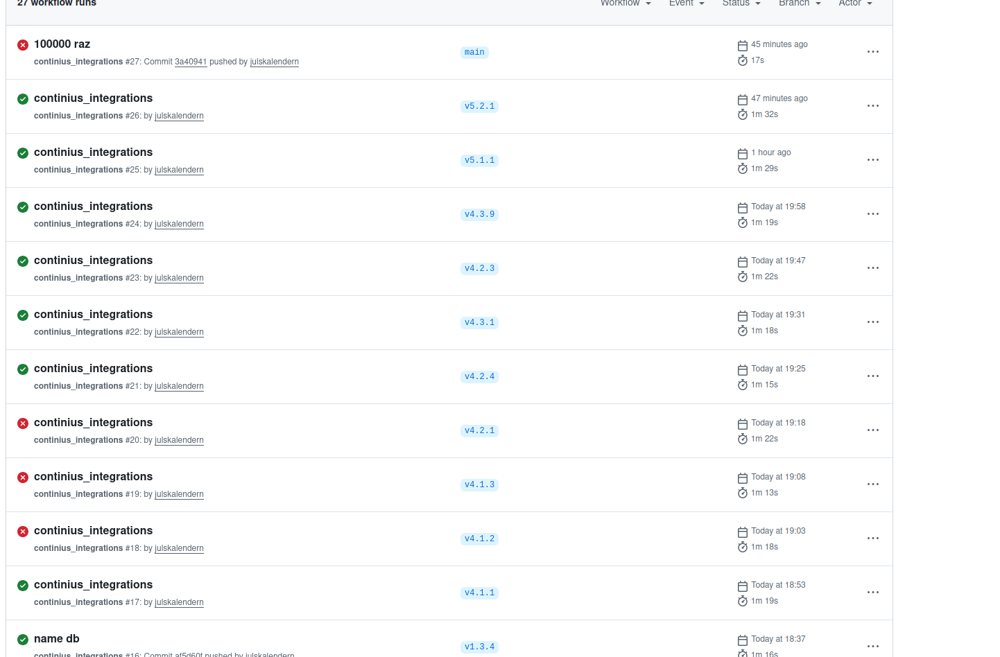
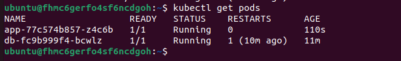
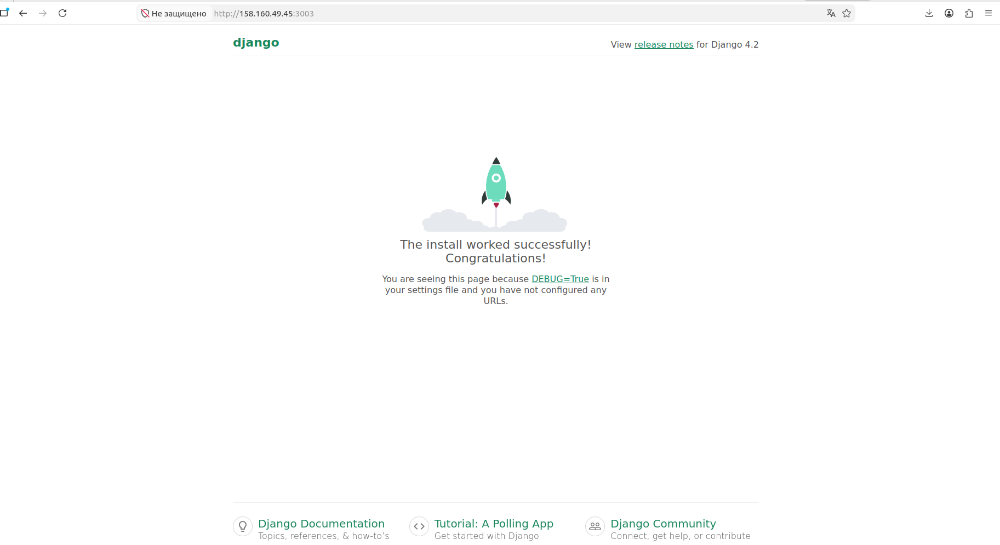

<h1>СПРИНТ 2</h1>
<i>

Были сделаны следующие исправления спринта 1:

<ul>
<li>terraform/main.tf: добавила для вм k8s-master, k8s-app недостающий сервисный аккаунт;</li>
<li>ansible: переделала роли для корректной установки компонентов на нужные ВМ</li>
<li>ansible: добавила установку helm на ВМ srv</li>
</ul>
</i>

<h2>Деплой приложения через Github Action</h2>
Клориуем репозиторий приложения:
<pre>
  git clone https://github.com/vinhlee95/django-pg-docker-tutorial
</pre>
В Dockerfile убираем ошибочное re в этом месте:
<pre>
RUN apk del .tmp-build-deps
re
RUN mkdir /app
WORKDIR /app
</pre>
Подключаемся к ВМ master и инициируем:
<pre>
  sudo kubeadm init --pod-network-cidr=192.168.0.0/16
</pre>
Полученный join инициируем на ВM app.
Генерируем конфигурационные файлы для сохранения в github secrets:
<pre>
mkdir -p $HOME/.kube
sudo cp -i /etc/kubernetes/admin.conf $HOME/.kube/config
sudo chown $(id -u):$(id -g) $HOME/.kube/config
</pre>
Выводим полученный файл, находим в нем <b>certificate-authority-data:</b> , удаляем этот блок и меняем <b>insecure-skip-tls-verify: true</b> 
Это нужно для того, чтобы отключить TLS для проблем с доступом. 
Разумеется, отключение только в рамках дипломной работы, на проде так делать не рекомендуется 
Сохраняем полученный файл в GithubSecrets.
<h3>Внимание! Чтобы не портить дипломный репозиторий бесконечными перезаливами, "оттачивала" пайплайн в другом своем - https://github.com/julskalendern/forimage</h3>
Пайплайн настроен таким образом, чтобы он запускался только при наличии тега.
На скрине видно,что обычный пуш в main сборку не запускал
 
На ВМ master проверяем подключенные ноды: 
 
Проверяем на ВМ app что приложение развернулось (также доступно на порту 30003)

