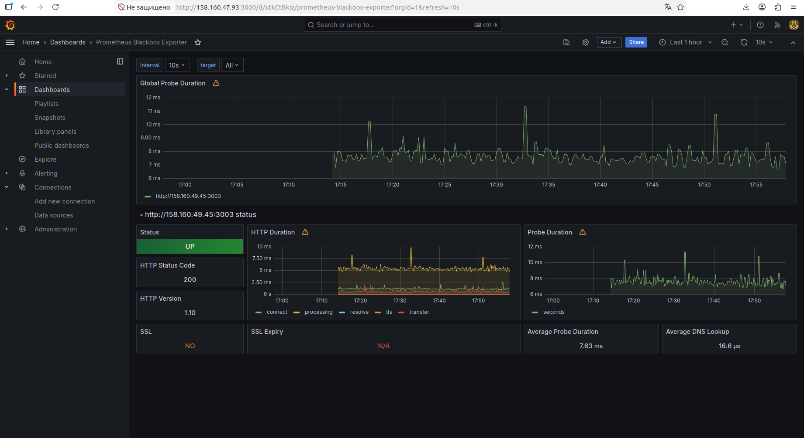
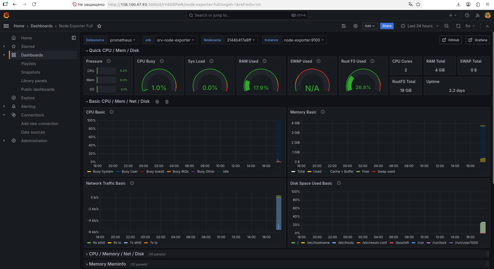
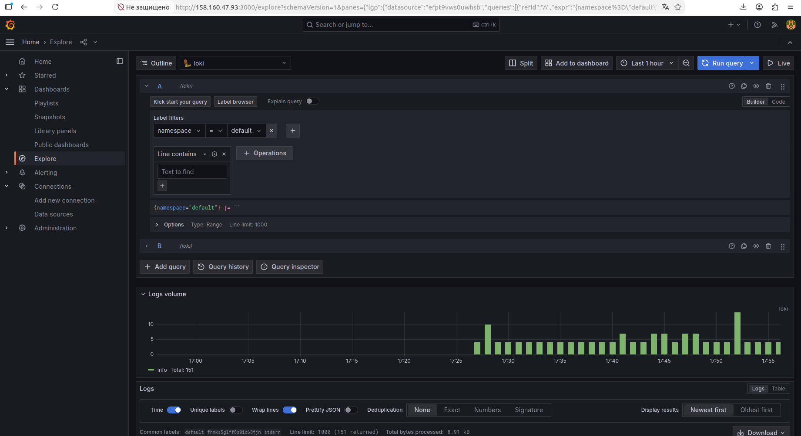
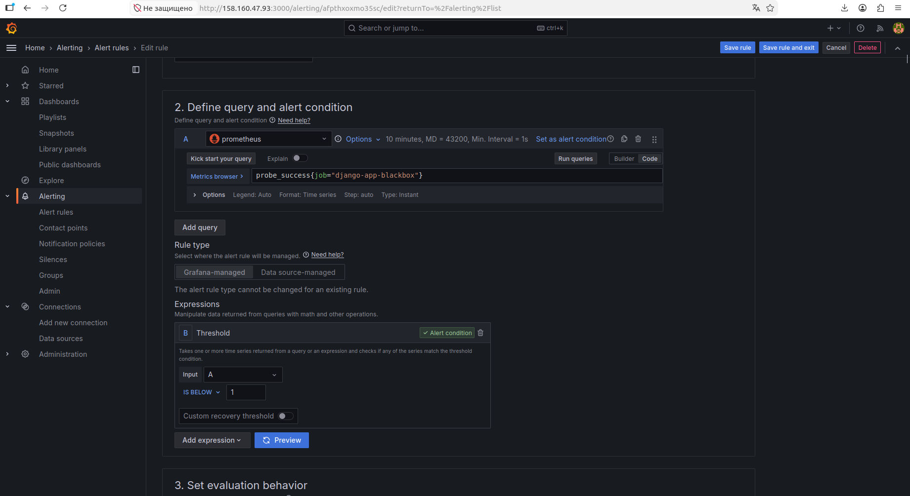
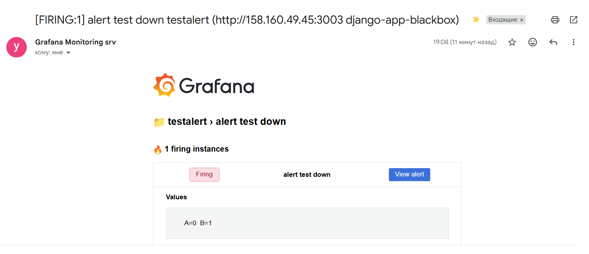

<h1>СПРИНТ 3</h1>
<i>Были сделаны следующие корректировки в спринт 2 для этого спринта:
<ul>
   <li>Github Actions - добавлена установка helm-чарта grafana и promtail для сбора логов приложений;</li>
  <li>Добавлен конфиг promtail-values.yaml для того же helm-чарта из пункта выше</li>
</ul>
<h2>Мониторинг</h2>

Для решения задачи использовались: <b>Loki, Promtail, Prometheus, Node Exporter, Blackbox Exporter</b>

Для визуализации  - <b>Grafana</b>

  

<i> Трудности, с которыми я столкнулась: 
Локи и прометеус запускались не в одной локали, поэтому не "видели" друг друга, не сразу вспомнила про то, что можно использовать networks.  
Локи упорно "натыкался" на permission denied, поэтому в docker-compose исползовала    user: "0:0"</i> 

 На ВМ srv для "поднятия" локи/прометеуса

<pre>
  cd sprint3/monitoring/loki && docker compose up -d
  cd sprint3/monitoring/prometheus && docker compose up -d
</pre>
В дашборде графаны импортируем дашборды с id 1860 и 7587: 
 
 
Проверяем логи Loki через Explore: 
 
<h2>Алертинг</h2>

Для алертинга я решила использовать графановский модуль, с отправкой письма на email.

Настроенные правила: 
 
Имитация "падения" и получение письма:
 
